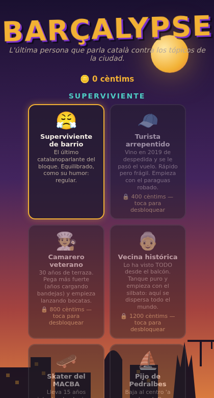
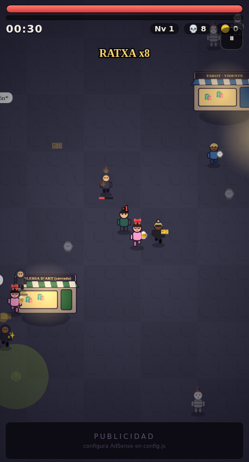
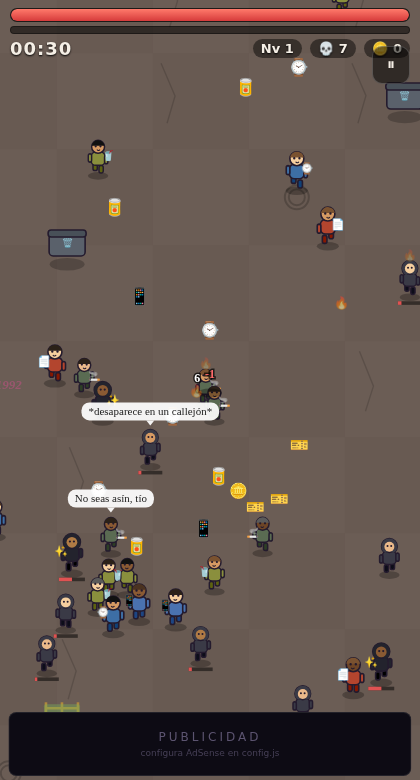
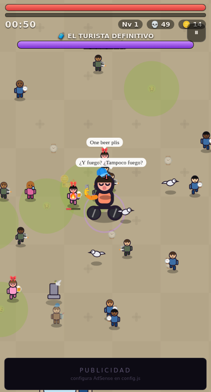
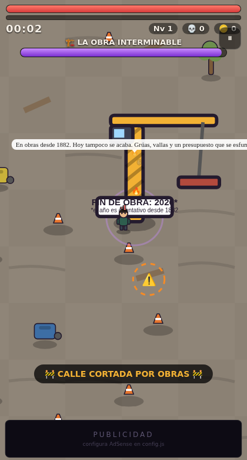

# 🥖🔥 BARÇALYPSE

> Roguelike de supervivencia estilo *Vampire Survivors* ambientado en una
> Barcelona caótica y satírica. Eres el último catalanoparlante del bloque:
> aguanta oleadas infinitas de tribus urbanas —guiris, Charos, patinetes,
> bandas del altavoz, apuñaladores de "dame todo", caseros— armado con un
> Clipper infinito, un cubo de sangría y muchísima mala leche.

| Menú | El Gòtic de noche | El Raval | El Turista Definitivo | La Obra Interminable |
|---|---|---|---|---|
|  |  |  |  |  |

## Jugar

Sin dependencias, sin build. Cualquier servidor estático:

```bash
python3 -m http.server 8000
# → http://localhost:8000
```

- **Móvil:** joystick virtual (arrastra el pulgar). Abre la IP de tu máquina desde el móvil en la misma red.
- **Escritorio:** WASD / flechas. `Esc` pausa.
- El ataque es automático: muévete, sobrevive 10 minutos y tumba al jefe del barrio.
- **Modo debug:** añade `?turbo` a la URL (jefe a los 45 s, XP ×3).

## Qué hay dentro

- **Sprites cartoon dibujados a mano en canvas** (cero assets): humanoides con ropa, capuchas, bandanas, caras, vehículos (taxi negro-amarillo, segway, moto de rider con mochila-cubo, carrito de la compra) y una grúa-jefe con cartel de "FIN DE OBRA: 202X*". El tono de piel de todos los humanoides se sortea de una paleta diversa: la sátira va de comportamientos, nunca de rasgos.
- **Escenarios con personalidad:** tiendas de FUNDES & VAPES, DÖNER KEBAB 2,50€, badulakes ALIMENTACIÓ 24H con neón, kioscos de las Rambles, farolas de gas que iluminan de verdad el Gòtic nocturno, panot de flor, mosaico de Miró, toallas, andamios, contenedores con la bolsa fuera.
- **28 enemigos** de todas las tribus urbanas: la banda del altavoz (el bajo te ralentiza físicamente), el de "dame todo", el ciclista de Strava, la señora del carrito, el trilero, la gaviota psicópata que te roba XP, el promotor de discoteca que te ARRASTRA a su lista VIP, el camarero de cuentas infladas teledirigidas, el crucerista con 45 minutos para "hacer" Barcelona…
- **13 armas** temáticas: Clipper, sangría, chancla teledirigida, litrona (cristales + empapado), dürüm de las 4 AM (atrae y funde), PERSIANAZO metálico, escuadrón de palomas de plaça Catalunya…
- **Combate por reglas declarativas** (pattern matching): `fuego + empapado → x3 ¡FLAMBEADO!`, `chancla + joven → x2,5 ¡LA CHANCLA!`, `comida + gaviota → x0,5 ¡LE ESTÁS DANDO DE COMER!`. Las sinergias añaden reglas nuevas al motor en caliente. Ver [`src/rules.js`](src/rules.js).
- **6 modificadores de dificultad** acumulables con multiplicador de cèntims: Temporada alta, Ola de calor, Huelga de metro, la Mercè, Alquiler al día (pierdes vida por segundo), Piso compartido (solo 3 armas).
- **6 personajes**, 6 barrios encadenados, 5 jefes con mecánicas propias (el Casero sube EL ALQUILER en tiempo real), élites, rachas, SFX procedurales WebAudio y meta-progresión persistente.

## Monetización y servicios (config.js)

El juego funciona tal cual; para producción rellena [`config.js`](config.js):

- **Anuncios (Google AdSense):** pon tu `adsenseClient` (`ca-pub-…`) y los
  `data-ad-slot` de 3 bloques display. Se cargan en dos raíles laterales
  (solo escritorio ≥1150 px) y un banner inferior que no pisa la zona de juego.
  Sin configurar, los huecos muestran un placeholder.
- **Guardado en la cuenta de Google del jugador (opcional):** crea un OAuth
  Client ID (Web) en Google Cloud Console con tu dominio como origen y ponlo
  en `googleClientId`. El progreso se guarda en el Drive appData del propio
  jugador (invisible para ti, sin backend). Botón "☁️ Guardar en Google" en el
  menú; sincroniza al conectar y sube tras cada partida.
- **Sin Google:** siempre disponible el código de guardado exportable
  (📋 Copiar / 📥 Importar) para llevarte el progreso entre dispositivos.

## Documentación

Documento de diseño completo (roster, jefes, reglas, tono y límites, roadmap)
en [`docs/GDD.md`](docs/GDD.md).

## Tono

Sátira ácida y autoparódica de TODAS las tribus urbanas por igual: se ríe de
**comportamientos y clichés** —del postureo, del bro de discoteca, del casero,
del cuñado, del guiri— y nunca de nacionalidad, etnia ni rasgos protegidos.
Sin violencia realista: aquí los tópicos no mueren, *se dispersan*.
