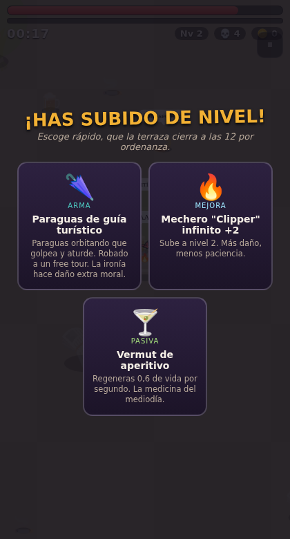

# 🥖🔥 BARÇALYPSE

> Roguelike de supervivencia estilo *Vampire Survivors* ambientado en una
> Barcelona caótica y satírica. Eres el último catalanoparlante del bloque:
> aguanta oleadas infinitas de tópicos urbanos —guiris, Charos, patinetes,
> caseros— armado con un Clipper infinito, un cubo de sangría y mucha mala leche.

| Menú | Jefe: El Turista Definitivo | Cartas de mejora |
|---|---|---|
|  |  |  |

## Jugar

Sin dependencias, sin build. Cualquier servidor estático:

```bash
python3 -m http.server 8000
# → http://localhost:8000
```

- **Móvil:** joystick virtual (arrastra el pulgar por la pantalla). Abre la IP de tu máquina desde el móvil en la misma red.
- **Escritorio:** WASD / flechas. `Esc` pausa.
- El ataque es automático: muévete, sobrevive 10 minutos y véncete al jefe del barrio.
- **Modo debug:** añade `?turbo` a la URL (jefe a los 45 s, XP ×3) para probar rápido.

## Qué hay dentro

- **6 barrios** con mecánica propia: Les Rambles, La Barceloneta (toallas que frenan), Gràcia (laberinto), El Born/Gòtic (nocturno), El Raval (rateros que te roban), Sagrada Família (vigas que caen).
- **17 enemigos** satíricos con 12 IA distintas y **5 jefes** con mecánicas únicas (el Casero del Airbnb te sube EL ALQUILER en tiempo real).
- **8 armas** temáticas de 5 niveles, cartas de pasivas y **sinergias que añaden reglas nuevas al motor de combate en caliente**.
- **Combate por reglas declarativas** (pattern matching): `fuego + empapado en sangría → daño x3` está escrito como dato, no como código. Ver [`src/rules.js`](src/rules.js).
- **Meta-progresión:** cèntims, 4 personajes desbloqueables, barrios encadenados (localStorage).

## Documentación

El documento de diseño completo (roster, jefes, reglas, tono y límites,
roadmap) está en [`docs/GDD.md`](docs/GDD.md).

## Tono

Sátira cariñosa y autoparódica: se ríe de **comportamientos y clichés
urbanos** —de todos, simétricamente— y nunca de nacionalidad, etnia ni
rasgos protegidos. Sin violencia realista: aquí los tópicos no mueren,
*se dispersan*.
